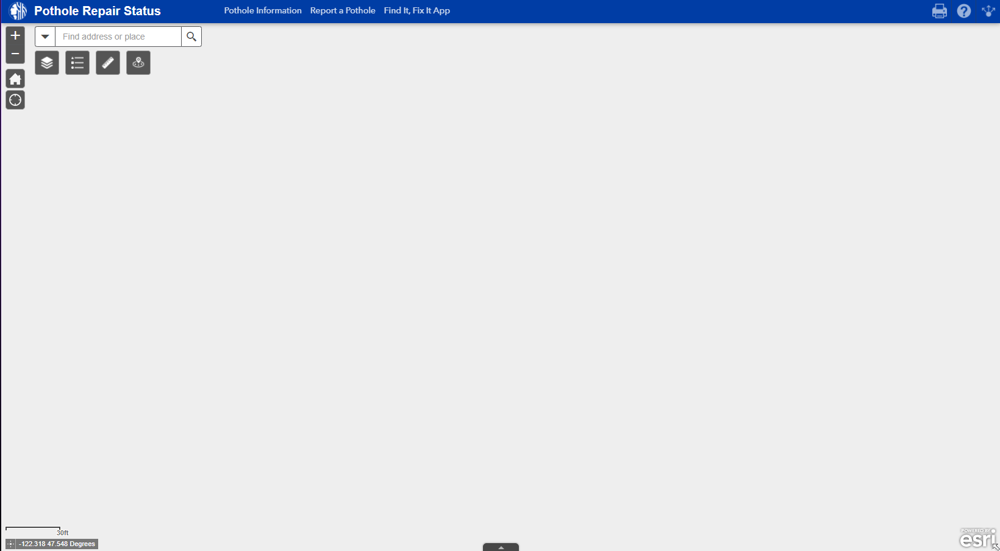

# Geog 458 Final Essay

# Seattle Department of Transportation Pothole Repair

For this essay I will be analyzing the Seattle Department of Transportation’s [Pothole Repair Status web map](https://arcg.is/0qHmT0). This map is run by the city and regularly updated to show both the location and repair status of potholes in the transit network in connection with the city’s *“Find It, Fix It”* App that allows the crowdsourced reporting of these public infrastructure issues. In effect this map allows the public to not only see that their repair requests are being registered, but that action is being taken to fix the potholes that are reported, likely further encouraging people to take the time to report these instances as well as reduce duplicate requests. 

## Who uses it?

This web app is publicly accessible, but it is clearly only intended to be used by residents of the supported areas of this map and does not provide much useful information or function for those who fall outside of this demographic. But the potential uses for those who this app is constructed for are numerous as the map can be used to not only check the status on reported issues as previously stated but can be used to locate potential potholes that have not been fixed yet and remain as potential road hazards. The map also reflects the city’s emphasis and punctuality regarding infrastructure upkeep, and both serves to keep the department of transportation accountable as well as inform the public to the state of the infrastructure.

## What can it do?

Its primary function is to show the spatial location and work status of these pothole reports, so in addition to the base visualization it allows users to filter results based on their work status. The various filters include pending projects, active projects, recently completed (90 days) and completed pothole separated by quarter up until 1 year ago. The filtering is further refined with the ability to enter an address and find nearby instances. In addition to this general spatial information and status, each point is interactable, popping up a window with each instance’s work order, request date, completion date, status, and address for those interested in specific instances. 

## What Web Mapping Elements does it use?

The map itself also offers numerous functions through its architecture such as the ability to be printed or embedded/shared as well as providing links to relevant resources like the “Find It, Fix It” App and an online pothole report form as well as more detailed information about the map. The web map elements it includes are also quite useful, such as the scale bar and cursor latitude and longitude in the bottom left corner, but what interested me the most was the inclusion of a digital ruler that allows a far more exact measurement between points than the scale bar allows. The ruler is able to calculate both area and distance, and although it is interesting, I am not sure what purpose it serves with this map.

## Data Displayed

- All pothole locations are sourced from the community through the *Find-It Fix-It* App
- Repair status and completion all come from the Seattle Deparment of Transportation themselves

---

## What's The Architecture Like?

In terms of the systematic architecture that this web map uses, the interface and architecture uses Esri’s ArcGIS “Web AppBuilder”, specifically the included jimu.js library, allowing for the various widgets included in the map interface. The base map appears to be a proprietary tile set from the city’s own GIS repository map server. These tiles go pretty detailed, and while the app does not include a zoom bar, the scale bar goes all the way down to 60ft showing an incredible amount of detail and zoom levels available through this tile set. The tile availability is a bit questionable, however. The data is understandably limited to King County’s metro areas, but it also includes limited coverage for areas like Snoqualmie, Duvall and Enumclaw while also missing coverage areas in Renton, Burien, and Federal Way. 

---

## How's the UI/UX?

As for the web map’s design and general U/UX it does leave some things to be desired. The zoom function is not limited to the available data either, so if one zooms too far in or out the map just becomes gray. Despite the limited data availability, a general base map is included for the entire state, but because the map extent isn’t limited either a user can scroll around the rest of the gray map however they like. These problems are offset a bit by the inclusion of home and location buttons that can reset the zoom and extent to supported areas of the map, but that does not excuse the issues entirely. Despite the map offering interactive elements it does not support responsive design at all. While the pothole points are visually distinctive from the base map and easy to discern from the base map, hovering over them doesn’t offer any indication that a pop-up would appear if they are clicked. No cursor change or icon change occurs to indicate that there is additional information available and I can easily see this feature being missed by a large number of users because of this. Because of the nature of the data being displayed, when looking at the data at a wider map extent it can appear very cluttered especially when viewing completed repairs. It is strange because the map already offers some clustering where larger symbols represent a larger number of potholes in the area, but the grouping does not change depending on the zoom level, so clusters apparent at larger extents do not merge together and appear cluttered and unreadable. Perhaps because of this, the competed pothole data does not show at lower zoom levels unlike the pending projects which can be a bit jarring. One thing that this map does well is its symbology. Not only are symbols differentiated by color, but their status can also be differentiated by the shape of the symbol with diamonds for incomplete projects and circles for complete ones. The base map is also quite good for this web map as the colors do not clash with the symbology at all while at the same time providing the useful street information and geographic context that is necessary to interpret the pothole data. 

---

## So is it Good?

All in all, this map definitely provides a useful service for its users and works to maintain an informed populace and an accountable government with a relatively sound web map in connection with the crowd-sourcing of these infrastructural issues. That being said the map is by no means perfect in it’s use or function, especially with the glaring lack of reactive design for a map that includes interactive elements which should be considered near criminal malpractice for web mapping and can lead to users missing all of the valuable context and information that these popups provide. While I do not think that the UX and UI flaws of this map will majorly impact or interfere with the majority of use cases for the targeted user base, the lack of limitations on zoom levels or max extent or other such UX problems can result in some bad experiences for users that may turn them off from the crowd-sourced reporting program as a whole and causing the department of transportation to lose some of that valuable feedback. For a program that relies primarily on crowd-sourced reports of information, the focus should overwhelmingly focus not just on responding to reports, but making the reporting process, and checking on report status as easy and intuitive as possible, because the more barriers that lie in the way of users the less likely they are to take the time our of their day to report an instance. So while the web map as it is does an ok job for what it aims to do, there are absolutely measures and changes that can be added to lessen the barrier to new users and continue to retain existing ones within the Find-It Fix-It ecosystem.

---

## Connection to Hacker Cartography and Open Source Ideals

Because of this web map’s reliance on crowd-sourced data and reports, it aligns well with the critique and consideration of [Hacker Cartography by Alan McConchie](https://drive.google.com/file/d/1H76GJFXwS5dOPZYyxfyuud0DGQzYGNIr/view). The application of this argument to this map does not fit exactly, as this map while using public-sourced data and being run by a public entity in the Seattle department of transportation it is still not open source or created and maintained by the public at large. However, in order to function this web map relies on the creation and maintenance of this community of users who unlike more standard internet platforms are not offered entertainment or a service for their use, but simply the promise that they are doing a public service and a public good by reporting these infrastructure issues. So, while this map doesn’t exhibit all of the open source or hacker cartography ideals, it continues to rely on the same sort of ethically minded community that can be found in a lot of these open source project examples. This method of data collection and use along with this web map that displays it not only allows the public users the ability to stay informed, but feel involved in the department of transportations mission to maintain the roads of the city, and when done properly can be a very beneficial and useful relationship for both parties to gain the benefits of these open source ideas without handing over complete control.
